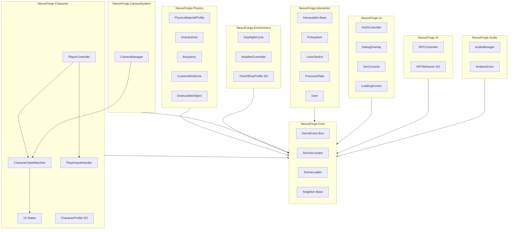

# Nexus Forge

[](https://github.com/dowdje/nexus-forge/actions/workflows/ci.yml)

A high-fidelity 3D platformer sandbox built with **Unity 6 (HDRP)**. Inspired by Myst, Elder Scrolls, and Assassin's Creed — featuring advanced traversal mechanics, dynamic weather, day/night cycles, and physics-driven interactions.

## Prerequisites

- **Unity 6000.1 LTS** (Unity 6) — install via [Unity Hub](https://unity.com/download)
- **Git LFS** — `git lfs install` (required for binary assets)
- **GitHub CLI** (`gh`) — optional, for CI/CD integration

## Quick Start

```bash
# Clone with LFS
git clone https://github.com/dowdje/nexus-forge.git
cd nexus-forge

# Open in Unity Hub
# 1. Unity Hub > Open > select nexus-forge/
# 2. Unity will import packages and generate .meta files (first open takes a few minutes)
# 3. Open Assets/_Project/Scenes/Boot.unity
# 4. Press Play
```

## Architecture



## Directory Structure

```
nexus-forge/
├── .github/
│   ├── workflows/ci.yml          # GameCI: test + build
│   └── PULL_REQUEST_TEMPLATE.md
├── Assets/
│   ├── _Project/
│   │   ├── Animations/            # Controllers/ & Clips/
│   │   ├── Art/                   # Materials/, Models/, Textures/, Shaders/
│   │   ├── Audio/                 # Music/, SFX/, Ambience/
│   │   ├── Prefabs/               # Characters/, Environment/, Interactables/, FX/, UI/
│   │   ├── Scenes/                # Boot, Sandbox, PhysicsLab, TraversalGym
│   │   ├── ScriptableObjects/     # GameConfig/, PhysicsProfiles/, CharacterProfiles/, Events/
│   │   ├── Scripts/               # Core/, Character/, Physics/, Camera/, Environment/,
│   │   │                          # Interaction/, UI/, Audio/, AI/, Utilities/, Editor/
│   │   └── Settings/              # InputActions, HDRP assets, Volume profiles
│   └── Plugins/                   # DOTween, NaughtyAttributes (manual install)
├── Packages/manifest.json         # 16 UPM packages + UniTask
├── ProjectSettings/               # Physics, layers, build settings
├── Tests/                         # NexusForge.Tests assembly
├── .gitignore
├── .gitattributes                 # Git LFS tracking
├── .editorconfig                  # C# conventions
└── README.md
```

## Controls

### Keyboard & Mouse

| Action | Binding |
|--------|---------|
| Move | WASD |
| Look | Mouse |
| Jump | Space |
| Sprint | Left Shift (hold) |
| Crouch / Slide | Left Ctrl |
| Interact | E |
| Attack | Left Mouse Button |
| Alt Attack | Right Mouse Button |
| Dodge / Roll | Q |
| Inventory | Tab |
| Pause | Escape |

### Gamepad

| Action | Binding |
|--------|---------|
| Move | Left Stick |
| Look | Right Stick |
| Jump | A / Cross |
| Sprint | L3 (Left Stick Press) |
| Crouch / Slide | B / Circle |
| Interact | X / Square |
| Attack | RT / R2 |
| Alt Attack | LT / L2 |
| Dodge / Roll | Y / Triangle |
| Inventory | Select / Share |
| Pause | Start / Options |

### Debug Keys

| Key | Action |
|-----|--------|
| ` (Backtick) | Toggle dev console |
| F3 | Toggle debug overlay |
| F5 | Toggle free camera |
| F6 | Increase time scale |
| F7 | Decrease time scale |
| F8 | Teleport to cursor |
| F12 | Screenshot |

## Character States

The player character uses a state machine with 13 states:

**Ground:** Idle, Walk, Sprint, Land, Slide
**Air:** Jump, DoubleJump, Fall
**Traversal:** WallRun, Climb, LedgeGrab
**Other:** Swim, Ragdoll

## Physics Configuration

| Parameter | Value |
|-----------|-------|
| Gravity | (0, -20, 0) — heavier than real for snappy jumps |
| Fixed Timestep | 0.01666s (60 Hz) |
| Solver Iterations | 8 |
| Velocity Iterations | 4 |
| Bounce Threshold | 2.0 |

### Custom Physics Layers (8-18)

| Layer | Name | Purpose |
|-------|------|---------|
| 8 | Player | Player character |
| 9 | PlayerTrigger | Ledge detection triggers |
| 10 | NPC | Non-player characters |
| 11 | Terrain | Ground, terrain meshes |
| 12 | Climbable | Climbable surfaces |
| 13 | WallRunnable | Wall-run surfaces |
| 14 | Interactable | Pickups, levers, doors |
| 15 | Destructible | Breakable objects |
| 16 | Water | Water volumes |
| 17 | Projectile | Thrown/launched objects |
| 18 | Ragdoll | Ragdoll physics bones |

## CI/CD Setup (GitHub Actions + GameCI)

The CI workflow uses [GameCI](https://game.ci/) to run tests and build for Windows, Linux, and macOS. **It requires a Unity license secret before it will pass.**

### Personal License (free)

1. In `.github/workflows/ci.yml`, uncomment the `activate` job
2. Push — the workflow will produce a `.alf` artifact
3. Download the `.alf` and upload it at https://license.unity3d.com/manual
4. Unity returns a `.ulf` file — copy its **entire contents**
5. Go to repo **Settings > Secrets and variables > Actions > New repository secret**
6. Name: `UNITY_LICENSE`, Value: paste the `.ulf` contents
7. Re-comment the `activate` job and push again

### Professional / Plus License

Set three repository secrets:

| Secret | Value |
|--------|-------|
| `UNITY_EMAIL` | Your Unity account email |
| `UNITY_PASSWORD` | Your Unity account password |
| `UNITY_SERIAL` | Seat license serial (`XXXX-XXXX-XXXX-XXXX-XXXX`) |

See the [GameCI activation docs](https://game.ci/docs/github/activation) for details.

## Post-Bootstrap Setup (Manual Unity Editor Steps)

After cloning and opening the project in Unity:

### 1. HDRP Configuration
- Open Edit > Project Settings > Quality, create an HDRP Asset
- Shadow Resolution: 4096 cascaded, 4 cascades, 200m distance
- LOD Bias: 2.0, Anti-Aliasing: TAA
- Lit Shader Mode: Both (Deferred + Forward)
- Enable: SSR, SSAO, Volumetric Fog, Volumetric Clouds

### 2. Global Volume Profile
Create a Volume Profile at `Assets/_Project/Settings/VolumeProfiles/` with:
- Tonemapping: ACES
- Bloom: Intensity 0.3, Threshold 1.1, Scatter 0.7
- Vignette: Intensity 0.25, Smoothness 0.4
- Color Adjustments: Saturation +5, Contrast +8
- Ambient Occlusion: Intensity 1.2, Radius 0.6
- Volumetric Fog: Base Height 0, Max Height 50, Mean Free Path 20

### 3. Create ScriptableObject Instances
- **CharacterProfile**: Assets > Create > NexusForge > Character > Character Profile
- **PhysicsMaterialProfiles** (7): Stone, Wood, Metal, Ice, Sand, Mud, Rubber — via Assets > Create > NexusForge > Physics > Material Profile
- **GameEvent channels** (8): OnPlayerDamaged, OnPlayerDied, OnCheckpointReached, OnItemPickedUp, OnDialogueTriggered, OnWeatherChanged, OnTimeOfDayChanged, OnPuzzleSolved
- **TimeOfDayProfiles**: Dawn, Noon, Dusk, Night presets

### 4. Cinemachine Virtual Cameras
Set up 5 cameras per Section 7:
- **ThirdPersonFollow**: Default exploration, 0.3s EaseInOut blend
- **ClimbCamera**: Tighter framing for wall climb / ledge
- **AimCamera**: Over-shoulder with reduced FOV
- **FreeLookCamera**: Debug free-look (F5)
- **CutsceneCamera**: Timeline-driven

### 5. Build Sandbox Scene
- 500x500m terrain with rolling hills, cliff face, canyon, flat arena
- Water body with sandy shore
- Place interactable prefabs (doors, levers, pressure plates, pickups)
- Bake lighting, reflection probes, and light probes

### 6. Configure Input System
- Open `Assets/_Project/Settings/InputActions.inputactions` in the Input System UI
- Verify bindings match the controls table above
- Assign the InputActions asset to the PlayerInput component

## Third-Party Dependencies

| Package | Source | Required |
|---------|--------|----------|
| [DOTween](http://dotween.demigiant.com/) | Unity Asset Store (free) | Yes — see `Assets/Plugins/DOTween/README.md` |
| [NaughtyAttributes](https://github.com/dbrizov/NaughtyAttributes) | Git / Asset Store (free) | Recommended — see `Assets/Plugins/NaughtyAttributes/README.md` |
| [UniTask](https://github.com/Cysharp/UniTask) | UPM Git URL | Yes — included in `manifest.json` |
| [Odin Inspector](https://odininspector.com/) | Asset Store (paid) | Optional — enhanced inspector |

## Assembly Structure

| Assembly | Depends On | Description |
|----------|-----------|-------------|
| `NexusForge.Core` | — | Event bus, service locator, scene management, singletons |
| `NexusForge.Character` | Core | Player controller, state machine, 13 states, input |
| `NexusForge.Physics` | Core | Materials, gravity zones, buoyancy, wind, destruction |
| `NexusForge.CameraSystem` | Core | Cinemachine priority management |
| `NexusForge.Environment` | Core | Day/night cycle, weather system |
| `NexusForge.Interaction` | Core | Interactables, pickups, levers, doors |
| `NexusForge.UI` | Core | HUD, debug overlay, dev console, loading screen |
| `NexusForge.AI` | Core | NPC controller, behavior profiles |
| `NexusForge.Audio` | Core | Audio manager, ambient zones |
| `NexusForge.Utilities` | Core | Object pool, screenshots, debug gizmos |
| `NexusForge.Editor` | All | Editor-only tools and inspectors |
| `NexusForge.Tests` | All | Edit/play mode tests |

## License

TBD — All rights reserved until a license is chosen.
